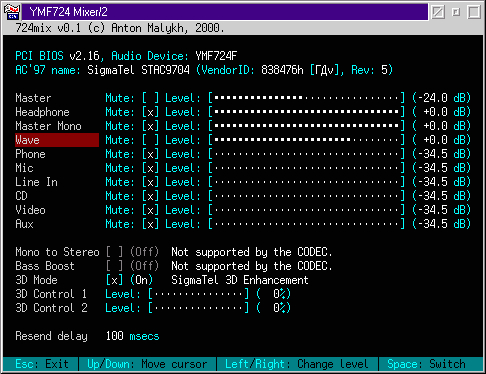

# 724mix - OS/2 mixer for YMF724

724mix (2000-2001) is a simple mixer with a text mode interface for YMF724 based sound cards.

**Warning**: some source files are missing. It is impossible to build the application.

Anton Malykh

See also:
- [724mix - OS/2 mixer for YMF724](https://malykh.blogspot.com/2024/03/724mix-os2-mixer-for-ymf724-os2-2000.html)
